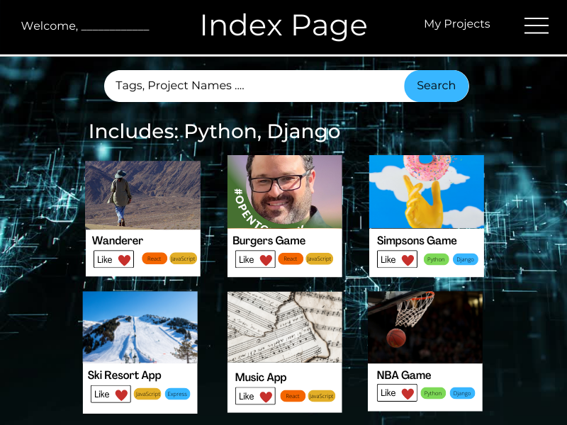
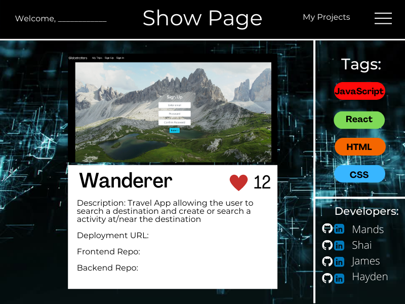
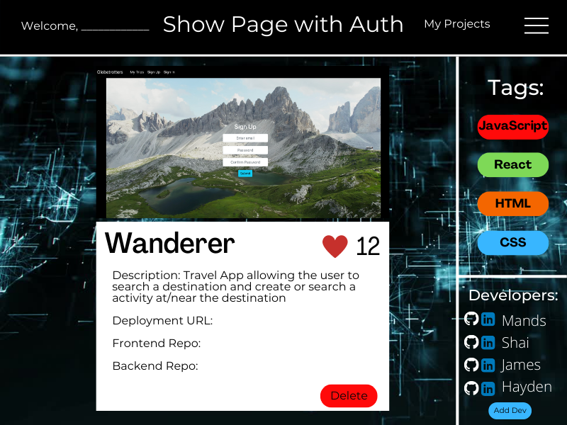
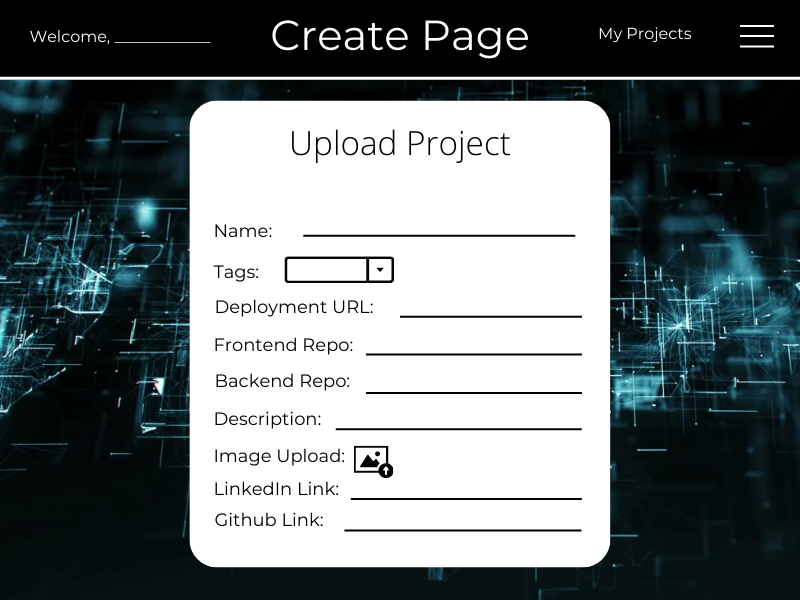
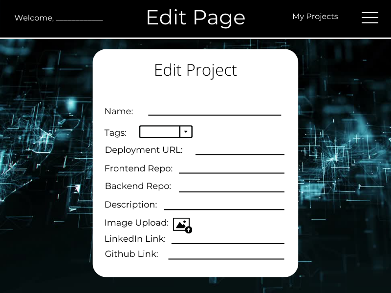
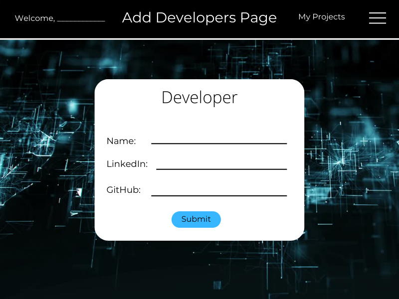
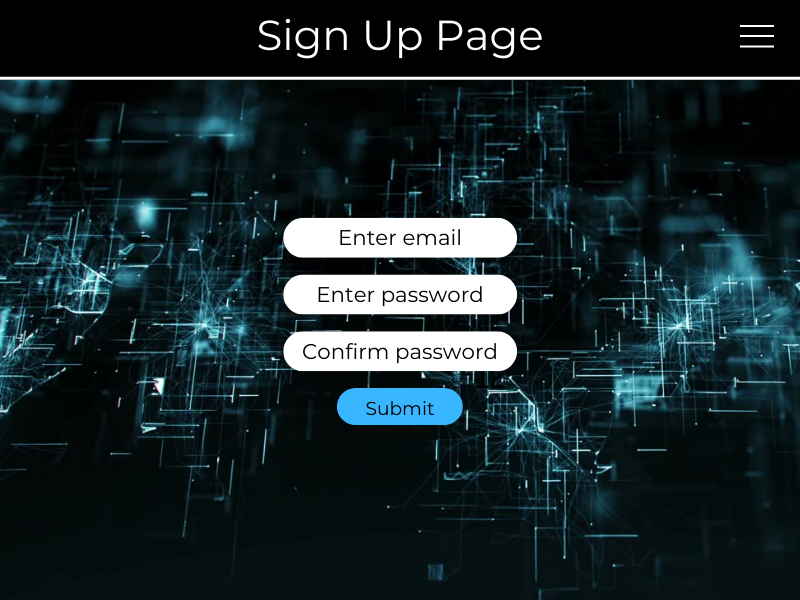
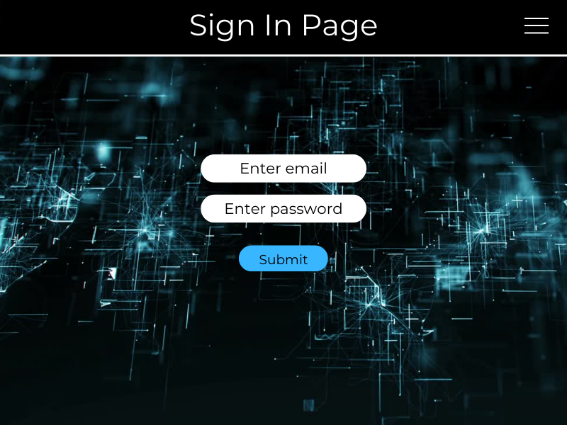
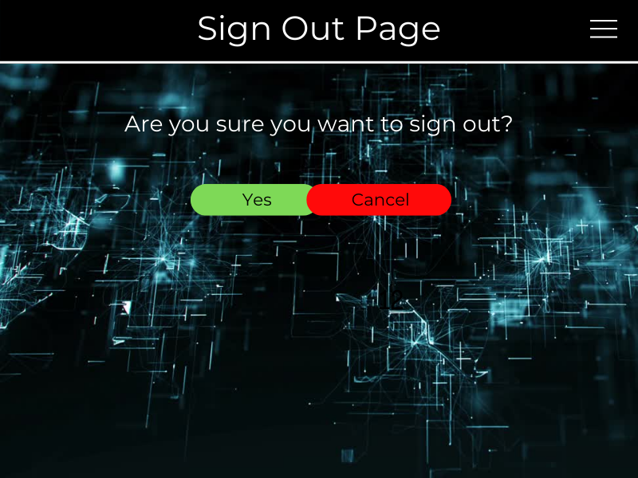

This is the client app, designed to work with the server app.
Repo to the server app is here:
https://github.com/tylly/project-4-mongoose-express
 
## About `Project name`

Our app is designed to be a platform for developers to showcase their work.
A developer can sign up, set up a personal profile, and post linked and images to all of their work.
Visitors are able to see all work posted and search through the different projects with tags, project names or developers.

 


### User Story

- As an unregistered user, I would like to view all projects filtered with tags.
- As an unregistered user, I would like to see one project in detail.
- As an unregistered user, I would like to sign up with an email and password.
- As a registered user, I would like to sign in with an email and password.
- As a signed in user, I would like to change my password.
- As a signed in user, I would like to sign out.
- As a signed in user, I would like to see all my projects. 
- As a signed in user, I would like to create a new project.
- As a signed in user, I would like to edit my existing project.
- As a signed in user, I would like to delete my existing project.
- As a signed in user, I would like to see all my developers profiles.
- As a signed in user, I would like to see in detail one developer profile. 
- As a signed in user, I would like to create a new developer profile.
- As a signed in user, I would like to edit my existing devloper profile.
- As a signed in user, I would like to delete an existing developer profile.

# Index Page 

# Show Page 

# Show Page with Auth

# Create Page 

# Edit Page 

# Add Devs Page 

# Sign Up Page 

# Sign In Page 

# Sign Out Page 


### Installation instructions
To use this app you will need to install all dependencies needed, and you can do that by running these commands in your command line:
 
```
$ npm install
```
```
$ npm start
```
 
This app will require an AWS account and an AWS bucket to be set up (see link to AWS below).
You will also need to set up an environment file (.env) with the following items:
TBD
- AWS key ID
- AWS secret key ID
- AWS bucket name
 
AWS_ACCESS_KEY_ID=" "
AWS_SECRET_ACCESS_KEY=" "
BUCKET=" "

### Technology Links:
TBD
###### AWS - https://aws.amazon.com/
###### Mongoose JS - https://mongoosejs.com/
###### MongoDB - https://www.mongodb.com/
###### NPM JS - https://www.npmjs.com/
# SEIR Project  `Project name` - client
 
